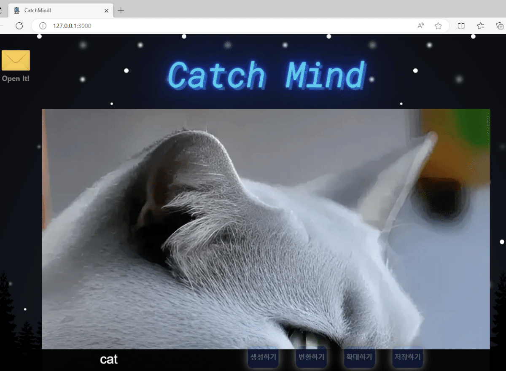

# 🔍프로젝트 소개
### Karlo Open API 활용 웹 서비스
</br></br>

# 👨‍👩‍👧‍👦팀원
**홍혜진** **임성실** **김태혁** **안성민**
</br></br>

# 🌝협업 방식

## 1. 역할분담
* 홍혜진 - 웹 페이지의 구조 정의 및 스타일적용
* 임성실 - NSFW 검사 및 이미지 저장 기능
* 김태혁 - 이미지 생성, 이미지 변환
* 안성민 - 이미지 확대 기능
</br></br>

## 2. 협업 툴
* Git
* Slack
* ESLint
</br></br>

# 🌟핵심 기능 및 구현 방법

## 1. 이미지 생성


- 입력받은 텍스트를 http://localhost:3000/generate 로 보냄
- server에서 karlo 이미지생성 api를 post
- app에서 생성된 이미지 src를 전달받고 src를 인코딩한 값 저장 및 이미지 띄움

## 2. 이미지 변환


- 이미지 파일을 Base64 인코딩한 값을 http://localhost:3000/change 로 보냄
- server에서 karlo 이미지변환 api를 post
- app에서 새롭게 생성된 이미지 src를 전달받고 src를 인코딩한 값 저장 및 이미지 띄움

## 3. 이미지 확대


- 이미지 파일을 Base64 인코딩한 값을 https://localhost:3000/imgScale 로 보냄
- server에서 karlo 이미지확대 api를 post
- app에서 생성된 이미지 src를 전달받고 src를 인코딩한 값 저장 및 이미지 띄움

## 4. NSFW 검사 & 저장


- 이미지 파일을 Base64 인코딩한 값을 http://localhost:3000/nsfw 로 보냄
- server에서 Karlo NSFW(Not Safe For Work, 폭력적이거나 선정적임) 검사 api를 post


- 검사 결과가 false일 경우(폭력적/선정적이지 않음) 저장하고 싶은지 확인 후 http://localhost:3000/- save-imgae 로 Base64 이미지 인코딩 값 보냄
- 이미지 저장 완료

</br></br>
# 👀트러블 슈팅

## 1. 이미지 파일 인코딩
카카오 api를 통해 생성된 이미지를 app.js에서 받아와서 바로 인코딩 변환을 하려고 시도를 하였는데 오류가 발생하였습니다.

오류 내용은 아래와 같습니다.

```
"app.js:80 Uncaught DOMException: Failed to execute 'toDataURL' on 'HTMLCanvasElement': Tainted canvases may not be exported.
at encodeImageToBase64 (http://localhost:3000/app.js:80:16)
at HTMLButtonElement.<anonymous> (http://localhost:3000/app.js:19:23)"
```

간단히 정리를 하면 캔버스가 타 도메인의 이미지로 인해 '오염(tainted)'되었음을 나타냅니다.</br>
웹 보안 정책에 따라, 다른 출처에서 가져온 이미지를 캔버스에 그리면 해당 캔버스는 **오염 상태**가 되고, 이 캔버스로부터 데이터를 추출하는 것은 제한된다는 뜻이였습니다.</br>
그래서 시도한 방법은 app.js 에서 이미지 소스를 server.js 에 보내고 그 곳에서 request.get을 통해 Buffer라는 함수를 통해 인코딩을 수행하여 얻어진 인코딩 된 값을 다시 app.js 로 보내는 방법으로 해결하였습니다.
## 2. API 전달 데이터 형식

이전 파파고 번역 api를 진행할 때 서버에서 전달받은 req.body를 바로 form에 넣어 전달을 했을 때는 잘 작동했습니다. 그러나 이번 카카오 karlo 이미지 생성 api를 위와 같은 방법으로 진행(body: req.body)하였는데 오류가 발생하였습니다.


	
api 요청을 할 때 body의 형태가 위의 요청을 보면 헤더에서 “Content-Type” : “application/json”을 통해 반드시 json의 형태로 전달을 해 달라는 문장이 있기 때문에 body를 JSON.stringify()로 json 형태로 보내줘야 했습니다.</br>

	app.js에서 req.body의 형태를 JSON.stringify()를 통해서 json으로 바꿔서 보냈는데 왜 또 json으로 해야하지??
	=> server.js 에서 사용한 “app.use(express.json());” 때문입니다!! -> 이 명령어로 인해서 server는 받아온 json형태의 데이터를 	Object(객체)로 바꿔버립니다! 파파고 api에서 잘 작동했던 이유는 파파고는 헤더에서 형태가 json이라고 따로 지정을 안했기 때문!!
앞으로도 api를 통해 전달을 할 일이 있을 때 각 api가 어떤 형태로 데이터를 전달하기 원하는지 잘 확인을 해야겠습니다!!
</br></br>
# ⚖️도메인 용어 정의

- `imgGen(text)` : 키워드에 따른 이미지 생성
- `imgScale()` : 이미지를 확대
- `imgChange()` : 생성된 이미지를 기반으로 새롭게 이미지 생성
- `imgNsfw()` : 이미지의 nsfw를 검사
- `toBase64(src)` : 이미지의 src 값을 base 64 형식으로 인코딩하여 리턴
- `saveImg()` : 이미지를 지정된 경로에 날짜와 시간을 제목으로 저장
- `img` : api 호출로 생성된 이미지
- `base64Image` : 이미지를 base64로 인코딩한 값
</br></br>

# 📖ESLint 규칙 및 적용 후기
* **괄호를 사용하는 방법**: "arrow-parens" 규칙을 사용하여 항상 괄호를 사용하도록 설정
* **띄어쓰기** : "indent" 규칙을 사용하여 들여쓰기를 탭으로 설정
* **콤마 위치** : "comma-style" 규칙을 사용하여 콤마를 줄 끝에 배치
* **세미콜론 사용** : "semi" 규칙을 사용하여 항상 세미콜론을 사용하도록 설정
* **줄 간격** : "no-multiple-empty-lines" 규칙을 사용하여 연속된 빈 줄을 허용하지 않음
* **주석 스타일** : "multiline-comment-style" 규칙을 사용하여 여러 줄 주석 스타일을 강제
* **따음표** : "quotes" 규칙을 사용하여 큰 따옴표 사용하도록 설정
</br></br>

각 팀원이 따로 작성한 코드임에도 전체 코드가 일관성 있는 것을 확인하면서 ESLint가 협업하기에 필수적인 라이브러리임을 느낄 수 있었습니다.
</br></br>
# 📝회고

### **홍혜진**
>2번째로 진행하는 프로젝트지만 어려움을 많이 느끼는 서버를 다루는 프로젝트라 시작 전 많이 두렵고 걱정이 많았습니다.
하지만 좋은 팀원들을 만나 서버 이해에 많이 도움받고, 설명 들으며 함께 해낼 수 있어 기뻤습니다. 또한 프로젝트를 진행하면서 해보고 싶었던 것들을 해볼 수 있게 팀원분들이 많이 배려해주셨고, 함께 고민해주셔서 끝까지 포기하지 않고 해낼 수 있었습니다.

### **임성실**
>강의 중 파파고 API 활용 과정에서 서버 흐름을 완벽하게 이해하지 못해서 아쉬웠는데 프로젝트를 하면서 더 이해하고 배울 수 있어서 정말 의미 있는 시간이었습니다. 가이드를 참고하여 코드를 작성하면서 API 요청과 응답 과정에서 필요한 것과 주고받는 흐름을 이해할 수 있었습니다. 프로젝트 진행 중에 여러 차례 수정하고 시도해도 막히는 부분이 있었는데 팀원들과 소통하면서 문제를 해결할 수 있었고 그 과정을 통해 많은 배움을 얻었습니다.
이번 프로젝트에서 처음으로 ESLint를 사용해보았는데, 각 팀원이 따로 작성한 코드임에도 전체 코드가 일관성 있는 것을 확인하면서 ESLint가 협업하기에 필수적인 라이브러리임을 느낄 수 있었습니다.

### **김태혁**
>협업을 진행하기 이전에 규칙을 정하고 시작을 하는 것이 굉장히 중요하다는 것을 느끼게 되었습니다.
규칙을 정하지 않고 개발을 개별적으로 진행을 하여 코드가 더러웠던 때와는 달리 처음부터 규칙을 정하고 eslint를 사용함으로써 쉽고 빠르게 가독성이 좋고 일관성을 유지할 수 있다는 것을 알게되었습니다.
또한 git을 사용하여 프로젝트를 진행할 때 처음 정한 규칙은 main, dev, feat/개인이 구현한 기능 브랜치로 나눠서 진행을 하고 각자 기능이 구현이 완료된 feat 브랜치들을 dev에서 통합을 하고 최종적으로 main 브랜치에 최종 코드를 구현하고자 규칙을 정하였습니다. 그러나 실제로 진행을 하면서 기본적인 틀이 되는 코드를 main 넣어야 하고 또 git이 아직 익숙하지 않아 정해진 규칙대로 진행이 되지 않았지만 이번 실수들을 토대로 다음에 진행할 때는 git 규칙을 처음부터 제대로 확립하고 수행할 수 있겠다고 생각하게 되었습니다.

### **안성민**
> 협업에서 진행상황 검토의 중요성을 느꼈습니다. 팀원들이 각자의 branch에서 기능을 만들고 dev branch에 merge 했어야 했는데 main 브랜치로 바로 merge하고 있었고 그것을 늦게 발견하였습니다. 프로젝트 진행 과정에서 merge 계획을 공유하였다면 실수를 예방할 수 있었을 것이라고 생각이 들었고, 다음 이 부분을 더 신경써야겠다고 생각했습니다.